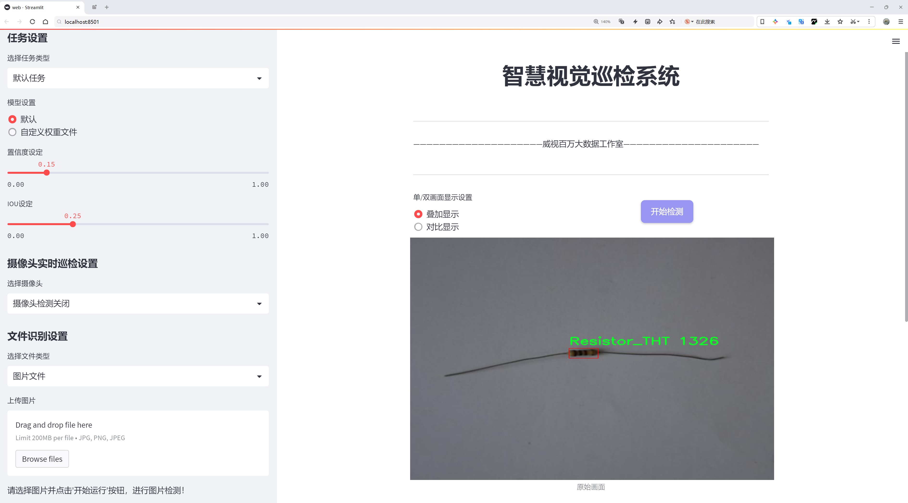
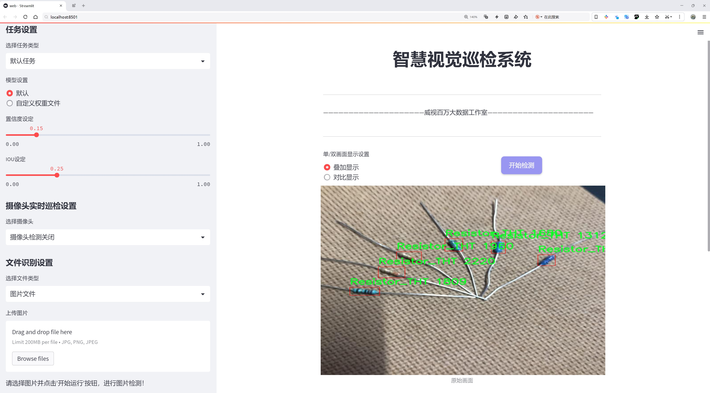
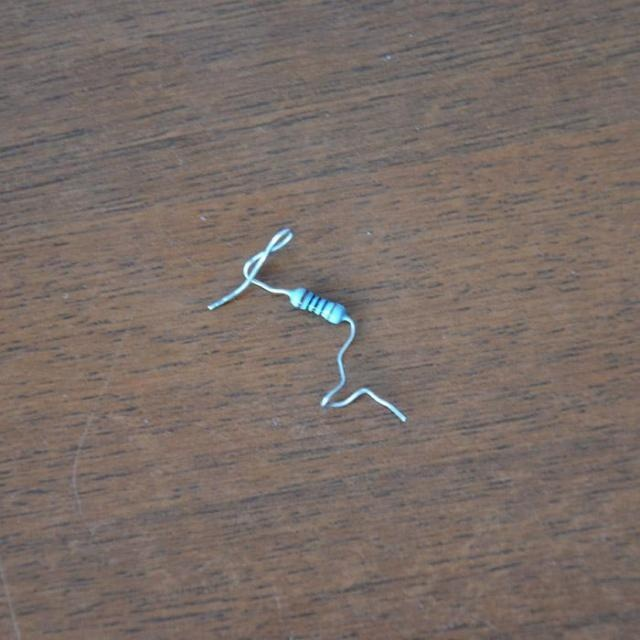
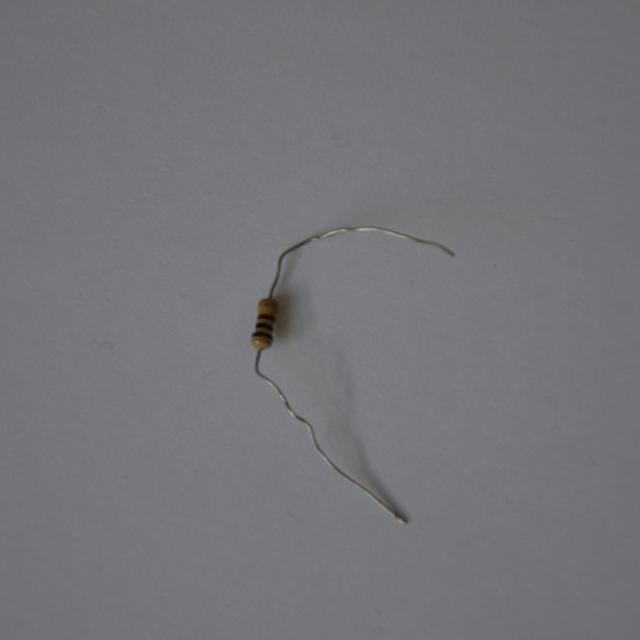
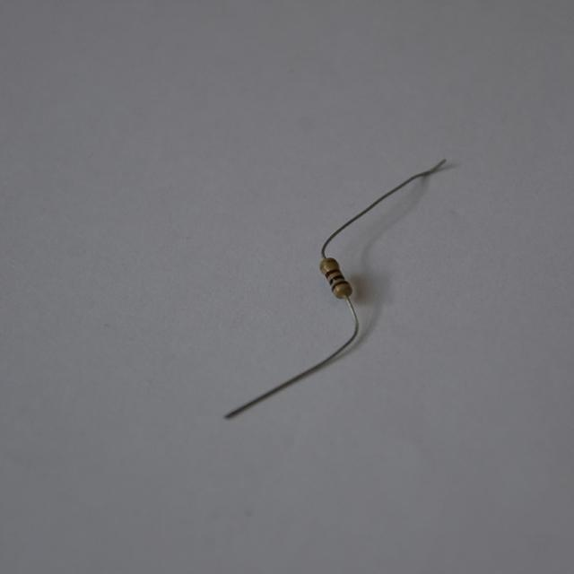
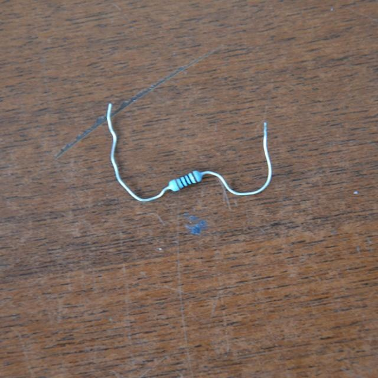
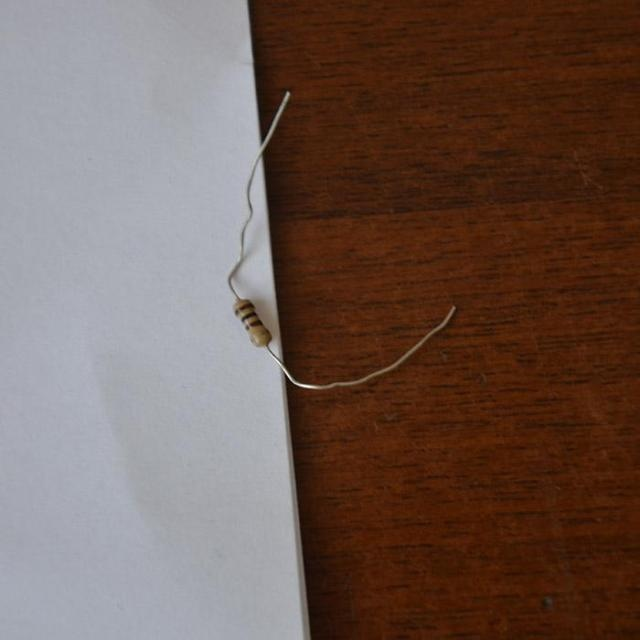

# 电子元件缺陷检测检测系统源码分享
 # [一条龙教学YOLOV8标注好的数据集一键训练_70+全套改进创新点发刊_Web前端展示]

### 1.研究背景与意义

项目参考[AAAI Association for the Advancement of Artificial Intelligence](https://gitee.com/qunshansj/projects)

项目来源[AACV Association for the Advancement of Computer Vision](https://gitee.com/qunmasj/projects)

研究背景与意义

随着电子技术的迅猛发展，电子元件的广泛应用使得其质量控制成为制造业中的一项重要任务。电子元件的缺陷不仅会影响产品的性能和可靠性，还可能导致严重的安全隐患。因此，如何高效、准确地检测电子元件的缺陷，成为了行业内亟待解决的问题。传统的人工检测方法由于依赖于人工经验，往往面临效率低、准确性差等问题，难以满足现代制造业对质量控制的高要求。因此，基于计算机视觉和深度学习的自动化检测系统逐渐成为研究的热点。

YOLO（You Only Look Once）系列模型因其在实时目标检测中的优越性能而受到广泛关注。YOLOv8作为该系列的最新版本，具备更高的检测精度和更快的处理速度，适合于实时监控和缺陷检测的应用场景。然而，针对电子元件的缺陷检测，YOLOv8模型仍需进行一定的改进，以适应特定的检测需求和数据特征。本研究旨在基于改进的YOLOv8模型，构建一个高效的电子元件缺陷检测系统，以提升检测的准确性和效率。

本研究所使用的数据集包含2300张图像，涵盖了四类电子元件：表面贴装电容器（Capacitor_SMD）、插装电容器（Capacitor_THT）、表面贴装电阻器（Resistor_SMD）和插装电阻器（Resistor_THT）。这些类别的选择不仅反映了电子元件的多样性，也代表了在实际生产中常见的缺陷类型。通过对这些数据的深入分析和处理，研究将重点关注如何提高模型在不同类别元件上的检测性能，尤其是在复杂背景和光照条件下的表现。

改进YOLOv8模型的研究意义在于，不仅可以提升电子元件缺陷检测的准确性，还能够实现更高的检测速度，从而满足现代生产线对实时监控的需求。此外，自动化检测系统的应用将大幅降低人工成本，提高生产效率，为企业带来更大的经济效益。同时，该系统的成功应用也将为其他领域的缺陷检测提供借鉴，推动计算机视觉技术在工业自动化中的广泛应用。

综上所述，基于改进YOLOv8的电子元件缺陷检测系统的研究，不仅具有重要的理论意义，也具有广泛的实际应用价值。通过深入探索和解决当前检测技术中的难点问题，本研究将为电子制造行业的质量控制提供新的思路和方法，助力实现智能制造的目标。

### 2.图片演示






##### 注意：由于此博客编辑较早，上面“2.图片演示”和“3.视频演示”展示的系统图片或者视频可能为老版本，新版本在老版本的基础上升级如下：（实际效果以升级的新版本为准）

  （1）适配了YOLOV8的“目标检测”模型和“实例分割”模型，通过加载相应的权重（.pt）文件即可自适应加载模型。

  （2）支持“图片识别”、“视频识别”、“摄像头实时识别”三种识别模式。

  （3）支持“图片识别”、“视频识别”、“摄像头实时识别”三种识别结果保存导出，解决手动导出（容易卡顿出现爆内存）存在的问题，识别完自动保存结果并导出到tempDir中。

  （4）支持Web前端系统中的标题、背景图等自定义修改，后面提供修改教程。

  另外本项目提供训练的数据集和训练教程,暂不提供权重文件（best.pt）,需要您按照教程进行训练后实现图片演示和Web前端界面演示的效果。

### 3.视频演示

[3.1 视频演示](https://www.bilibili.com/video/BV1w9t5e3Ebi/)

### 4.数据集信息展示

##### 4.1 本项目数据集详细数据（类别数＆类别名）

nc: 4
names: ['Capacitor_SMD', 'Capacitor_THT', 'Resistor_SMD', 'Resistor_THT']


##### 4.2 本项目数据集信息介绍

数据集信息展示

在现代电子制造业中，确保产品质量至关重要。为此，开发一个高效的电子元件缺陷检测系统显得尤为重要。本研究所采用的数据集名为“inspection PCB”，该数据集专门用于训练和改进YOLOv8模型，以实现对电子元件的精准检测和缺陷识别。数据集的设计旨在涵盖多种常见的电子元件类型，确保模型在实际应用中的广泛适用性和高效性。

“inspection PCB”数据集包含四个主要类别，分别是：表面贴装电容器（Capacitor_SMD）、插装电容器（Capacitor_THT）、表面贴装电阻器（Resistor_SMD）和插装电阻器（Resistor_THT）。这些类别的选择反映了现代电路板上最常见的电子元件类型，涵盖了从消费电子到工业设备中广泛使用的关键组件。每个类别都具有独特的物理特征和潜在的缺陷类型，因此在数据集的构建过程中，确保每个类别的样本具有足够的多样性和代表性是至关重要的。

在数据集的构建过程中，研究团队收集了大量的图像数据，这些图像涵盖了不同的拍摄角度、光照条件和背景环境。这种多样性不仅提高了模型的鲁棒性，还增强了其在实际应用中的适应能力。每个类别的图像均经过精心标注，确保模型能够准确识别出每种电子元件及其可能存在的缺陷。这些缺陷可能包括焊接不良、元件错位、表面污染等，都是影响电子产品性能和可靠性的关键因素。

为了提高模型的训练效果，数据集还包含了多种数据增强技术的应用。这些技术包括随机裁剪、旋转、亮度调整等，旨在增加训练样本的多样性，防止模型过拟合。通过这些手段，研究团队希望能够训练出一个具有较强泛化能力的YOLOv8模型，使其能够在不同的生产环境中准确识别和分类电子元件。

在模型训练过程中，数据集的质量和多样性直接影响到最终检测系统的性能。因此，研究团队在数据集的构建和标注过程中，严格遵循数据科学的最佳实践，确保每个样本的准确性和一致性。此外，数据集的设计还考虑到了未来的扩展性，研究团队计划在后续的工作中，逐步增加更多类别的电子元件和缺陷类型，以进一步提升检测系统的全面性和实用性。

总之，“inspection PCB”数据集为改进YOLOv8的电子元件缺陷检测系统提供了坚实的基础。通过精心设计的类别结构和丰富的样本数据，该数据集不仅能够有效支持模型的训练，还为后续的研究和应用奠定了良好的基础。随着电子产品的不断发展和市场需求的变化，持续优化和扩展数据集将是未来研究的重要方向。











### 5.全套项目环境部署视频教程（零基础手把手教学）

[5.1 环境部署教程链接（零基础手把手教学）](https://www.ixigua.com/7404473917358506534?logTag=c807d0cbc21c0ef59de5)


[5.2 安装Python虚拟环境创建和依赖库安装视频教程链接（零基础手把手教学）](https://www.ixigua.com/7404474678003106304?logTag=1f1041108cd1f708b01a)

### 6.手把手YOLOV8训练视频教程（零基础小白有手就能学会）

[6.1 手把手YOLOV8训练视频教程（零基础小白有手就能学会）](https://www.ixigua.com/7404477157818401292?logTag=d31a2dfd1983c9668658)

### 7.70+种全套YOLOV8创新点代码加载调参视频教程（一键加载写好的改进模型的配置文件）

[7.1 70+种全套YOLOV8创新点代码加载调参视频教程（一键加载写好的改进模型的配置文件）](https://www.ixigua.com/7404478314661806627?logTag=29066f8288e3f4eea3a4)

### 8.70+种全套YOLOV8创新点原理讲解（非科班也可以轻松写刊发刊，V10版本正在科研待更新）

由于篇幅限制，每个创新点的具体原理讲解就不一一展开，具体见下列网址中的创新点对应子项目的技术原理博客网址【Blog】：


[8.1 70+种全套YOLOV8创新点原理讲解链接](https://gitee.com/qunmasj/good)

### 9.系统功能展示（检测对象为举例，实际内容以本项目数据集为准）

图9.1.系统支持检测结果表格显示

  图9.2.系统支持置信度和IOU阈值手动调节

  图9.3.系统支持自定义加载权重文件best.pt(需要你通过步骤5中训练获得)

  图9.4.系统支持摄像头实时识别

  图9.5.系统支持图片识别

  图9.6.系统支持视频识别

  图9.7.系统支持识别结果文件自动保存

  图9.8.系统支持Excel导出检测结果数据


### 10.原始YOLOV8算法原理

原始YOLOv8算法原理

YOLOv8作为目标检测领域的最新代表，延续了YOLO系列算法的优良传统，同时在多个方面进行了创新和优化。其核心结构由输入层、主干网络、颈部网络和头部网络构成，形成了一个高效且灵活的目标检测框架。通过对输入图像进行缩放处理，YOLOv8能够适应不同的输入尺寸需求，从而为后续的特征提取和目标检测奠定基础。

在主干网络部分，YOLOv8采用了卷积操作进行特征的下采样，利用批归一化和SiLUR激活函数增强了特征提取的能力。值得注意的是，YOLOv8引入了C2f模块，这一模块在YOLOv5的C3模块基础上进行了改进，结合了YOLOv7中的ELAN结构，通过跨层分支连接来增强模型的梯度流。这种设计不仅提高了特征提取的效率，还在轻量化的基础上丰富了模型的梯度信息，使得YOLOv8在目标检测任务中表现出色。

在主干网络的末尾，YOLOv8引入了SPPFl模块，通过三个最大池化层处理多尺度特征，从而提升了网络的特征抽象能力。这一设计使得YOLOv8能够更好地应对不同尺寸目标的检测任务，增强了模型的适应性和鲁棒性。

颈部网络则利用了PAN-FPN结构来融合不同尺度的特征图信息。PAN结构的引入，使得YOLOv8能够有效地结合来自主干网络的多层特征，从而在目标检测过程中更好地捕捉到目标的细节信息。这一部分的设计对于提升检测精度和召回率至关重要，因为它确保了模型能够综合考虑多层次的特征信息。

YOLOv8的头部网络采用了解耦合的检测头结构，将分类和检测任务分离开来。这样的设计不仅提升了模型的推理速度，还提高了分类和回归的精度。YOLOv8的检测头通过两个并行的卷积分支分别计算回归和类别的损失，这种解耦合的方式使得模型在处理复杂场景时，能够更为精准地进行目标定位和分类。

在损失计算方面，YOLOv8采用了BCELoss作为分类损失，DFLLoss和CIoULoss作为回归损失。这种多样化的损失函数设计，进一步增强了模型在训练过程中的稳定性和收敛速度。通过动态Task-Aligned Assigner样本分配策略，YOLOv8在训练阶段能够更有效地利用数据，从而提升了模型的泛化能力。

值得一提的是，YOLOv8在模型的设置上提供了多种选择，包括n、s、m、l、x五种不同尺度的模型。每种模型在深度、宽度和特征图的通道数上都有所不同，用户可以根据具体应用场景的需求，选择最合适的模型。这种灵活性使得YOLOv8能够广泛应用于各类目标检测任务中，从而满足不同场景的需求。

综上所述，YOLOv8通过对主干网络、颈部网络和头部网络的精心设计与优化，形成了一个高效、精准的目标检测框架。其创新的C2f模块、解耦合的检测头结构以及多样化的损失函数设计，使得YOLOv8在目标检测领域中具备了更快的推理速度和更高的检测精度。这些特性使得YOLOv8不仅在学术界受到广泛关注，也在工业界得到了广泛应用，成为了目标检测任务中的一项重要工具。


### 11.项目核心源码讲解（再也不用担心看不懂代码逻辑）

#### 11.1 code\ultralytics\models\yolo\segment\predict.py

以下是对代码的核心部分进行提炼和详细注释的结果：

```python
# 导入必要的模块和类
from ultralytics.engine.results import Results
from ultralytics.models.yolo.detect.predict import DetectionPredictor
from ultralytics.utils import DEFAULT_CFG, ops

class SegmentationPredictor(DetectionPredictor):
    """
    SegmentationPredictor类，继承自DetectionPredictor类，用于基于分割模型的预测。
    """

    def __init__(self, cfg=DEFAULT_CFG, overrides=None, _callbacks=None):
        """
        初始化SegmentationPredictor，设置配置、覆盖参数和回调函数。
        
        参数:
        - cfg: 配置文件，默认为DEFAULT_CFG
        - overrides: 覆盖配置的参数
        - _callbacks: 回调函数
        """
        super().__init__(cfg, overrides, _callbacks)  # 调用父类构造函数
        self.args.task = "segment"  # 设置任务类型为分割

    def postprocess(self, preds, img, orig_imgs):
        """
        对每个输入图像的预测结果进行后处理，包括非极大值抑制和掩膜处理。
        
        参数:
        - preds: 模型的预测结果
        - img: 输入图像
        - orig_imgs: 原始输入图像

        返回:
        - results: 处理后的结果列表
        """
        # 应用非极大值抑制，过滤掉冗余的检测框
        p = ops.non_max_suppression(
            preds[0],  # 预测框
            self.args.conf,  # 置信度阈值
            self.args.iou,  # IOU阈值
            agnostic=self.args.agnostic_nms,  # 是否使用类别无关的NMS
            max_det=self.args.max_det,  # 最大检测框数量
            nc=len(self.model.names),  # 类别数量
            classes=self.args.classes,  # 指定的类别
        )

        # 如果输入图像不是列表，则将其转换为numpy数组
        if not isinstance(orig_imgs, list):
            orig_imgs = ops.convert_torch2numpy_batch(orig_imgs)

        results = []  # 初始化结果列表
        proto = preds[1][-1] if len(preds[1]) == 3 else preds[1]  # 获取掩膜原型

        # 遍历每个预测结果
        for i, pred in enumerate(p):
            orig_img = orig_imgs[i]  # 获取原始图像
            img_path = self.batch[0][i]  # 获取图像路径

            if not len(pred):  # 如果没有检测到框
                masks = None  # 掩膜设置为None
            elif self.args.retina_masks:  # 如果使用Retina掩膜
                # 对预测框进行缩放
                pred[:, :4] = ops.scale_boxes(img.shape[2:], pred[:, :4], orig_img.shape)
                # 处理掩膜
                masks = ops.process_mask_native(proto[i], pred[:, 6:], pred[:, :4], orig_img.shape[:2])  # HWC
            else:  # 否则使用普通掩膜处理
                masks = ops.process_mask(proto[i], pred[:, 6:], pred[:, :4], img.shape[2:], upsample=True)  # HWC
                # 对预测框进行缩放
                pred[:, :4] = ops.scale_boxes(img.shape[2:], pred[:, :4], orig_img.shape)

            # 将结果添加到结果列表中
            results.append(Results(orig_img, path=img_path, names=self.model.names, boxes=pred[:, :6], masks=masks))

        return results  # 返回处理后的结果列表
```

### 代码核心部分说明：
1. **类定义**：`SegmentationPredictor`类用于图像分割任务，继承自`DetectionPredictor`类。
2. **初始化方法**：在构造函数中设置任务类型为分割，并调用父类的构造函数进行初始化。
3. **后处理方法**：`postprocess`方法负责对模型的预测结果进行后处理，包括非极大值抑制、掩膜处理和结果的组织。处理后的结果以`Results`对象的形式返回，包含原始图像、路径、类别名称、检测框和掩膜信息。

这个文件是一个用于YOLO（You Only Look Once）模型的分割预测的实现，具体是Ultralytics YOLO框架中的一部分。文件中定义了一个名为`SegmentationPredictor`的类，它继承自`DetectionPredictor`类，主要用于基于分割模型进行预测。

在类的文档字符串中，给出了一个使用示例，展示了如何导入该类并进行实例化以及调用预测功能。示例中，用户可以通过传入模型文件和数据源来创建`SegmentationPredictor`的实例，并使用`predict_cli()`方法进行预测。

构造函数`__init__`用于初始化`SegmentationPredictor`，它接受配置参数、覆盖参数和回调函数。通过调用父类的构造函数，设置了一些基本的配置，并将任务类型指定为“segment”，表示这是一个分割任务。

`postprocess`方法是该类的核心功能之一，它负责对模型的预测结果进行后处理。具体来说，该方法首先应用非极大值抑制（Non-Maximum Suppression, NMS）来过滤掉冗余的检测框，确保每个目标只保留一个最佳框。接着，方法会检查输入的原始图像是否为列表，如果不是，则将其转换为NumPy数组格式。

在处理每个预测结果时，方法会根据预测的内容和设置的参数，生成相应的掩膜（masks）。如果没有检测到目标，掩膜将设置为`None`。如果启用了`retina_masks`选项，方法会使用不同的处理方式来生成掩膜。最终，所有的结果都会被封装成`Results`对象，包含原始图像、路径、类别名称、检测框和掩膜等信息，并将这些结果以列表的形式返回。

总的来说，这个文件的主要功能是为YOLO模型的分割任务提供预测和后处理的实现，确保用户能够方便地使用该模型进行图像分割。

#### 11.2 ui.py

```python
import sys
import subprocess

def run_script(script_path):
    """
    使用当前 Python 环境运行指定的脚本。

    Args:
        script_path (str): 要运行的脚本路径

    Returns:
        None
    """
    # 获取当前 Python 解释器的路径
    python_path = sys.executable

    # 构建运行命令
    command = f'"{python_path}" -m streamlit run "{script_path}"'

    # 执行命令
    result = subprocess.run(command, shell=True)
    if result.returncode != 0:
        print("脚本运行出错。")


# 实例化并运行应用
if __name__ == "__main__":
    # 指定您的脚本路径
    script_path = "web.py"  # 这里可以直接指定脚本名称

    # 运行脚本
    run_script(script_path)
```

### 代码注释说明：

1. **导入模块**：
   - `import sys`：导入 sys 模块，以便获取当前 Python 解释器的路径。
   - `import subprocess`：导入 subprocess 模块，用于执行外部命令。

2. **定义函数 `run_script`**：
   - 该函数接受一个参数 `script_path`，表示要运行的 Python 脚本的路径。
   - 函数内部首先获取当前 Python 解释器的路径（`sys.executable`），然后构建一个命令字符串，用于运行指定的脚本。

3. **构建命令**：
   - 使用 f-string 格式化命令，调用 `streamlit` 模块来运行指定的脚本。

4. **执行命令**：
   - 使用 `subprocess.run` 方法执行构建的命令，并通过 `shell=True` 选项允许在 shell 中执行。
   - 检查命令的返回码，如果不为 0，表示脚本运行出错，打印错误信息。

5. **主程序入口**：
   - 使用 `if __name__ == "__main__":` 确保只有在直接运行该脚本时才会执行以下代码。
   - 指定要运行的脚本路径（这里直接使用 `"web.py"`）。
   - 调用 `run_script` 函数，传入脚本路径以执行该脚本。

这个程序文件的主要功能是使用当前的 Python 环境来运行一个指定的脚本，具体来说是运行一个名为 `web.py` 的脚本。程序首先导入了必要的模块，包括 `sys`、`os` 和 `subprocess`，这些模块分别用于处理系统相关的功能、文件路径操作和执行外部命令。

在 `run_script` 函数中，首先获取当前 Python 解释器的路径，这通过 `sys.executable` 实现。接着，构建一个命令字符串，该命令使用 `streamlit` 模块来运行指定的脚本。这里使用了 Python 的 `-m` 选项来指定模块，后面跟上要运行的脚本路径。

随后，程序使用 `subprocess.run` 方法来执行构建好的命令。这个方法会在一个新的 shell 中运行命令，并等待其完成。执行完命令后，程序检查返回码，如果返回码不为零，说明脚本运行出错，此时会打印出错误信息。

在文件的最后部分，程序通过 `if __name__ == "__main__":` 这一条件判断来确保只有在直接运行该文件时才会执行后面的代码。在这里，指定了要运行的脚本路径为 `web.py`，并调用 `run_script` 函数来执行该脚本。

总体来说，这个程序提供了一种简单的方式来运行一个特定的 Python 脚本，并且能够处理运行过程中的错误。

#### 11.3 code\ultralytics\data\augment.py

以下是代码中最核心的部分，并附上详细的中文注释：

```python
class BaseTransform:
    """
    图像变换的基类。

    这是一个通用的变换类，可以扩展以满足特定的图像处理需求。
    该类旨在与分类和语义分割任务兼容。

    方法：
        __init__: 初始化 BaseTransform 对象。
        apply_image: 对标签应用图像变换。
        apply_instances: 对标签中的对象实例应用变换。
        apply_semantic: 对图像应用语义分割。
        __call__: 对图像、实例和语义掩码应用所有标签变换。
    """

    def __init__(self) -> None:
        """初始化 BaseTransform 对象。"""
        pass

    def apply_image(self, labels):
        """对标签应用图像变换。"""
        pass

    def apply_instances(self, labels):
        """对标签中的对象实例应用变换。"""
        pass

    def apply_semantic(self, labels):
        """对图像应用语义分割。"""
        pass

    def __call__(self, labels):
        """对图像、实例和语义掩码应用所有标签变换。"""
        self.apply_image(labels)
        self.apply_instances(labels)
        self.apply_semantic(labels)


class Mosaic(BaseMixTransform):
    """
    Mosaic 增强。

    该类通过将多个（4 或 9）张图像组合成一张马赛克图像来执行马赛克增强。
    增强以给定的概率应用于数据集。

    属性：
        dataset: 应用马赛克增强的数据集。
        imgsz (int, optional): 单张图像马赛克管道后的图像大小（高度和宽度）。默认为 640。
        p (float, optional): 应用马赛克增强的概率。必须在 0-1 范围内。默认为 1.0。
        n (int, optional): 网格大小，4（2x2）或 9（3x3）。
    """

    def __init__(self, dataset, imgsz=640, p=1.0, n=4):
        """初始化对象，传入数据集、图像大小、概率和边界。"""
        assert 0 <= p <= 1.0, f"概率应在 [0, 1] 范围内，但得到 {p}。"
        assert n in (4, 9), "网格必须等于 4 或 9。"
        super().__init__(dataset=dataset, p=p)
        self.dataset = dataset
        self.imgsz = imgsz
        self.border = (-imgsz // 2, -imgsz // 2)  # 宽度，高度
        self.n = n

    def get_indexes(self, buffer=True):
        """返回数据集中随机索引的列表。"""
        if buffer:  # 从缓冲区选择图像
            return random.choices(list(self.dataset.buffer), k=self.n - 1)
        else:  # 选择任意图像
            return [random.randint(0, len(self.dataset) - 1) for _ in range(self.n - 1)]

    def _mix_transform(self, labels):
        """对标签字典应用 MixUp 或 Mosaic 增强。"""
        assert labels.get("rect_shape", None) is None, "rect 和 mosaic 是互斥的。"
        assert len(labels.get("mix_labels", [])), "没有其他图像用于马赛克增强。"
        return (
            self._mosaic3(labels) if self.n == 3 else self._mosaic4(labels) if self.n == 4 else self._mosaic9(labels)
        )

    def _mosaic4(self, labels):
        """创建 2x2 图像马赛克。"""
        mosaic_labels = []
        s = self.imgsz
        yc, xc = (int(random.uniform(-x, 2 * s + x)) for x in self.border)  # 马赛克中心 x, y
        for i in range(4):
            labels_patch = labels if i == 0 else labels["mix_labels"][i - 1]
            img = labels_patch["img"]
            h, w = labels_patch.pop("resized_shape")

            # 将图像放置在 img4 中
            if i == 0:  # 左上角
                img4 = np.full((s * 2, s * 2, img.shape[2]), 114, dtype=np.uint8)  # 基础图像，包含 4 个图块
                x1a, y1a, x2a, y2a = max(xc - w, 0), max(yc - h, 0), xc, yc  # xmin, ymin, xmax, ymax（大图像）
                x1b, y1b, x2b, y2b = w - (x2a - x1a), h - (y2a - y1a), w, h  # xmin, ymin, xmax, ymax（小图像）
            elif i == 1:  # 右上角
                x1a, y1a, x2a, y2a = xc, max(yc - h, 0), min(xc + w, s * 2), yc
                x1b, y1b, x2b, y2b = 0, h - (y2a - y1a), min(w, x2a - x1a), h
            elif i == 2:  # 左下角
                x1a, y1a, x2a, y2a = max(xc - w, 0), yc, xc, min(s * 2, yc + h)
                x1b, y1b, x2b, y2b = w - (x2a - x1a), 0, w, min(y2a - y1a, h)
            elif i == 3:  # 右下角
                x1a, y1a, x2a, y2a = xc, yc, min(xc + w, s * 2), min(s * 2, yc + h)
                x1b, y1b, x2b, y2b = 0, 0, min(w, x2a - x1a), min(y2a - y1a, h)

            img4[y1a:y2a, x1a:x2a] = img[y1b:y2b, x1b:x2b]  # img4[ymin:ymax, xmin:xmax]
            padw = x1a - x1b
            padh = y1a - y1b

            labels_patch = self._update_labels(labels_patch, padw, padh)
            mosaic_labels.append(labels_patch)
        final_labels = self._cat_labels(mosaic_labels)
        final_labels["img"] = img4
        return final_labels

    @staticmethod
    def _update_labels(labels, padw, padh):
        """更新标签。"""
        nh, nw = labels["img"].shape[:2]
        labels["instances"].convert_bbox(format="xyxy")
        labels["instances"].denormalize(nw, nh)
        labels["instances"].add_padding(padw, padh)
        return labels

    def _cat_labels(self, mosaic_labels):
        """返回带有马赛克边界实例裁剪的标签。"""
        if len(mosaic_labels) == 0:
            return {}
        cls = []
        instances = []
        imgsz = self.imgsz * 2  # 马赛克图像大小
        for labels in mosaic_labels:
            cls.append(labels["cls"])
            instances.append(labels["instances"])
        # 最终标签
        final_labels = {
            "im_file": mosaic_labels[0]["im_file"],
            "ori_shape": mosaic_labels[0]["ori_shape"],
            "resized_shape": (imgsz, imgsz),
            "cls": np.concatenate(cls, 0),
            "instances": Instances.concatenate(instances, axis=0),
            "mosaic_border": self.border,
        }
        final_labels["instances"].clip(imgsz, imgsz)
        good = final_labels["instances"].remove_zero_area_boxes()
        final_labels["cls"] = final_labels["cls"][good]
        return final_labels
```

### 代码核心部分说明
1. **BaseTransform 类**：定义了图像变换的基类，包含应用图像、实例和语义分割的方法，便于扩展和实现具体的变换。
2. **Mosaic 类**：实现了马赛克增强，通过将多张图像组合成一张马赛克图像来增强数据集。提供了生成随机索引、更新标签和拼接标签的方法。
3. **_mosaic4 方法**：实现了 2x2 的马赛克图像生成，负责将四张图像放置在马赛克的不同位置。
4. **_update_labels 方法**：更新标签的边界框信息，确保在马赛克图像中正确反映每个实例的位置。
5. **_cat_labels 方法**：合并所有马赛克图像的标签，返回最终的标签字典。

这些核心部分构成了图像增强过程中的重要环节，有助于提高模型的泛化能力。

这个程序文件 `code\ultralytics\data\augment.py` 是用于图像增强的工具，主要应用于计算机视觉任务，如目标检测和图像分类。文件中定义了多个类和方法，旨在对输入图像及其标签进行各种变换和增强，以提高模型的鲁棒性和泛化能力。

首先，文件中导入了一些必要的库，包括数学库、随机数生成库、OpenCV、NumPy、PyTorch 和一些自定义的工具函数。接着，定义了一些常量，如默认的均值和标准差，用于图像归一化。

接下来，定义了一个 `BaseTransform` 类，这是一个基类，用于处理图像变换。它包含了一些方法，用于应用不同类型的变换，如图像、实例和语义分割的变换。该类的设计使得它可以被扩展，以满足特定的图像处理需求。

`Compose` 类用于组合多个图像变换，允许用户将多个变换按顺序应用于输入数据。这个类的设计使得用户可以灵活地添加、删除或重新排列变换。

`BaseMixTransform` 类是一个基类，用于实现混合增强（如 MixUp 和 Mosaic）。这个类的子类可以实现具体的混合增强逻辑。`Mosaic` 类用于将多个图像组合成一个马赛克图像，通过在给定概率下选择多个图像并将它们拼接在一起，增强了数据的多样性。

`MixUp` 类则实现了 MixUp 增强，通过将两张图像及其标签进行线性组合，生成新的图像和标签。这种方法有助于生成更多的训练样本，从而提高模型的性能。

`RandomPerspective` 类实现了随机透视变换和仿射变换，可以对图像及其对应的边界框、分割和关键点进行旋转、平移、缩放和剪切等操作。这些变换可以根据给定的概率进行应用，增加了数据的多样性。

`RandomHSV` 类负责对图像的色调、饱和度和亮度进行随机调整，以增强图像的色彩变化。`RandomFlip` 类则用于随机翻转图像，可以是水平翻转或垂直翻转，并相应地更新实例（如边界框和关键点）。

`LetterBox` 类用于调整图像大小并进行填充，以适应目标检测、实例分割和姿态估计任务。它确保图像在保持纵横比的同时，调整到指定的形状，并在必要时添加边框。

`CopyPaste` 类实现了图像的复制粘贴增强，能够将一个图像的实例复制到另一个图像上，从而生成新的训练样本。

`Albumentations` 类提供了一系列额外的增强方法，利用第三方库 `albumentations` 来实现模糊、对比度自适应直方图均衡、随机亮度和对比度变化等。

最后，文件中还定义了一些用于分类任务的增强方法，包括 `classify_transforms` 和 `classify_augmentations`，这些方法利用 PyTorch 的 `torchvision.transforms` 模块进行图像预处理和增强。

整体来看，这个文件提供了一个灵活且强大的框架，用于对图像进行多种增强处理，以提高计算机视觉模型的训练效果和性能。

#### 11.4 70+种YOLOv8算法改进源码大全和调试加载训练教程（非必要）\ultralytics\hub\session.py

以下是经过简化并添加详细中文注释的核心代码部分：

```python
import signal
import sys
from time import sleep
import requests
from ultralytics.hub.utils import HUB_API_ROOT, HUB_WEB_ROOT, smart_request
from ultralytics.utils import LOGGER, is_colab
from ultralytics.utils.errors import HUBModelError

AGENT_NAME = f'python-{__version__}-colab' if is_colab() else f'python-{__version__}-local'

class HUBTrainingSession:
    """
    HUBTrainingSession类用于Ultralytics HUB YOLO模型的训练会话，处理模型初始化、心跳和检查点上传。
    """

    def __init__(self, url):
        """
        初始化HUBTrainingSession，使用提供的模型标识符。

        参数:
            url (str): 用于初始化HUB训练会话的模型标识符。
        """
        from ultralytics.hub.auth import Auth

        # 解析输入的模型URL
        if url.startswith(f'{HUB_WEB_ROOT}/models/'):
            url = url.split(f'{HUB_WEB_ROOT}/models/')[-1]
        if [len(x) for x in url.split('_')] == [42, 20]:
            key, model_id = url.split('_')
        elif len(url) == 20:
            key, model_id = '', url
        else:
            raise HUBModelError(f"model='{url}' not found. Check format is correct.")

        # 授权
        auth = Auth(key)
        self.model_id = model_id
        self.model_url = f'{HUB_WEB_ROOT}/models/{model_id}'
        self.api_url = f'{HUB_API_ROOT}/v1/models/{model_id}'
        self.auth_header = auth.get_auth_header()
        self.alive = True
        self._start_heartbeat()  # 启动心跳
        self._register_signal_handlers()  # 注册信号处理器
        LOGGER.info(f'查看模型: {self.model_url} 🚀')

    def _register_signal_handlers(self):
        """注册信号处理器以优雅地处理终止信号。"""
        signal.signal(signal.SIGTERM, self._handle_signal)
        signal.signal(signal.SIGINT, self._handle_signal)

    def _handle_signal(self, signum, frame):
        """
        处理终止信号，停止心跳并退出程序。
        """
        if self.alive:
            LOGGER.info('接收到终止信号! ❌')
            self._stop_heartbeat()
            sys.exit(signum)

    def _stop_heartbeat(self):
        """终止心跳循环。"""
        self.alive = False

    @threaded
    def _start_heartbeat(self):
        """开始一个线程的心跳循环，定期报告代理的状态。"""
        while self.alive:
            smart_request('post',
                          f'{HUB_API_ROOT}/v1/agent/heartbeat/models/{self.model_id}',
                          json={'agent': AGENT_NAME},
                          headers=self.auth_header)
            sleep(300)  # 每300秒发送一次心跳

    def upload_metrics(self):
        """上传模型的指标到Ultralytics HUB。"""
        payload = {'metrics': self.metrics_queue.copy(), 'type': 'metrics'}
        smart_request('post', self.api_url, json=payload, headers=self.auth_header)

    def upload_model(self, epoch, weights, is_best=False, map=0.0, final=False):
        """
        上传模型检查点到Ultralytics HUB。

        参数:
            epoch (int): 当前训练的轮次。
            weights (str): 模型权重文件的路径。
            is_best (bool): 当前模型是否是迄今为止最好的模型。
            map (float): 模型的平均精度。
            final (bool): 模型是否为训练后的最终模型。
        """
        if Path(weights).is_file():
            with open(weights, 'rb') as f:
                file = f.read()
        else:
            LOGGER.warning(f'模型上传问题: 缺少模型 {weights}.')
            file = None

        url = f'{self.api_url}/upload'
        data = {'epoch': epoch}
        if final:
            data.update({'type': 'final', 'map': map})
            smart_request('post', url, data=data, files={'final_model.pt': file}, headers=self.auth_header)
        else:
            data.update({'type': 'epoch', 'isBest': bool(is_best)})
            smart_request('post', url, data=data, files={'last_model.pt': file}, headers=self.auth_header)
```

### 代码注释说明：
1. **类的定义**：`HUBTrainingSession`类用于管理Ultralytics HUB的训练会话，包括模型的初始化、心跳机制和指标上传。
2. **初始化方法**：在`__init__`方法中，解析输入的模型URL并进行授权，设置模型的相关属性，并启动心跳机制。
3. **信号处理**：注册了对终止信号的处理，确保在接收到信号时能够优雅地停止心跳并退出程序。
4. **心跳机制**：通过一个线程定期向Ultralytics HUB发送心跳请求，报告代理的状态。
5. **上传指标和模型**：提供了上传模型指标和模型检查点的方法，确保训练过程中的数据能够及时反馈到Ultralytics HUB。

这个程序文件是一个用于Ultralytics HUB YOLO模型训练会话的Python类，名为`HUBTrainingSession`。它主要负责模型的初始化、心跳信号的发送以及检查点的上传。程序开始时导入了一些必要的库，包括信号处理、系统操作、路径处理、时间延迟和HTTP请求等。

在类的构造函数`__init__`中，接收一个模型标识符`url`，并解析这个标识符以获取模型的关键信息。根据输入的URL格式，程序会提取出模型的密钥和模型ID，并进行相应的授权。如果提供的模型标识符格式不正确，程序会抛出一个自定义的异常`HUBModelError`。接下来，程序会设置一些属性，如模型的URL、API URL、认证头、速率限制、计时器、模型的度量队列以及从Ultralytics HUB获取的模型数据。然后，它会启动心跳信号的发送，并注册信号处理程序，以便在接收到终止信号时能够优雅地处理程序的退出。

程序中还定义了一些私有方法。`_register_signal_handlers`用于注册信号处理程序，`_handle_signal`用于处理终止信号，确保在Colab环境中终止后不再发送心跳信号。`_stop_heartbeat`则用于停止心跳循环。`upload_metrics`方法用于将模型的度量数据上传到Ultralytics HUB。`_get_model`方法则负责从Ultralytics HUB获取模型数据，并根据模型的状态决定是开始新的训练还是恢复已有的训练。

此外，`upload_model`方法用于将模型的检查点上传到Ultralytics HUB。它会根据当前的训练周期、权重文件的路径、是否是最佳模型等信息进行上传。最后，`_start_heartbeat`方法是一个线程化的心跳循环，定期向Ultralytics HUB报告代理的状态。

整体来看，这个类的设计目的是为了方便用户在Ultralytics HUB上进行YOLO模型的训练和管理，提供了必要的功能来处理模型的上传、状态监控和错误处理。

#### 11.5 70+种YOLOv8算法改进源码大全和调试加载训练教程（非必要）\ultralytics\utils\callbacks\dvc.py

以下是经过简化和注释的核心代码部分：

```python
# 导入必要的库
from ultralytics.utils import LOGGER, SETTINGS, TESTS_RUNNING, checks

try:
    # 确保测试未运行，并且DVC集成已启用
    assert not TESTS_RUNNING  
    assert SETTINGS['dvc'] is True  
    import dvclive  # 导入DVCLive库
    assert checks.check_version('dvclive', '2.11.0', verbose=True)  # 检查DVCLive版本

    import os
    import re
    from pathlib import Path

    # DVCLive日志记录实例
    live = None
    _processed_plots = {}  # 记录已处理的图表

    # 用于区分最佳模型的最终评估与最后一个epoch验证的标志
    _training_epoch = False

except (ImportError, AssertionError, TypeError):
    dvclive = None  # 如果导入失败，设置dvclive为None


def _log_images(path, prefix=''):
    """记录指定路径的图像，带有可选前缀。"""
    if live:  # 如果DVCLive实例存在
        name = path.name
        # 根据批次分组图像，以便在UI中启用滑块
        m = re.search(r'_batch(\d+)', name)
        if m:
            ni = m[1]
            new_stem = re.sub(r'_batch(\d+)', '_batch', path.stem)
            name = (Path(new_stem) / ni).with_suffix(path.suffix)

        live.log_image(os.path.join(prefix, name), path)  # 记录图像


def on_pretrain_routine_start(trainer):
    """在预训练例程开始时初始化DVCLive日志记录器。"""
    try:
        global live
        live = dvclive.Live(save_dvc_exp=True, cache_images=True)  # 创建DVCLive实例
        LOGGER.info("DVCLive已检测到，自动记录已启用。")
    except Exception as e:
        LOGGER.warning(f'警告 ⚠️ DVCLive安装但未正确初始化，未记录此运行。 {e}')


def on_train_start(trainer):
    """如果DVCLive日志记录处于活动状态，则记录训练参数。"""
    if live:
        live.log_params(trainer.args)  # 记录训练参数


def on_fit_epoch_end(trainer):
    """在每个fit epoch结束时记录训练指标和模型信息。"""
    global _training_epoch
    if live and _training_epoch:  # 如果DVCLive存在且当前为训练epoch
        all_metrics = {**trainer.label_loss_items(trainer.tloss, prefix='train'), **trainer.metrics, **trainer.lr}
        for metric, value in all_metrics.items():
            live.log_metric(metric, value)  # 记录每个指标

        _training_epoch = False  # 结束当前训练epoch


def on_train_end(trainer):
    """在训练结束时记录最佳指标、图表和混淆矩阵。"""
    if live:
        all_metrics = {**trainer.label_loss_items(trainer.tloss, prefix='train'), **trainer.metrics, **trainer.lr}
        for metric, value in all_metrics.items():
            live.log_metric(metric, value, plot=False)  # 记录最佳指标

        # 记录混淆矩阵
        if trainer.validator:
            _log_confusion_matrix(trainer.validator)

        live.end()  # 结束DVCLive记录


# 定义回调函数字典
callbacks = {
    'on_pretrain_routine_start': on_pretrain_routine_start,
    'on_train_start': on_train_start,
    'on_fit_epoch_end': on_fit_epoch_end,
    'on_train_end': on_train_end
} if dvclive else {}
```

### 代码说明：
1. **导入模块**：导入必要的库和模块，确保DVC集成可用。
2. **DVCLive实例**：创建一个`live`实例用于记录训练过程中的各种信息。
3. **日志记录函数**：
   - `_log_images`：记录图像，支持按批次分组。
   - `on_pretrain_routine_start`：在预训练开始时初始化DVCLive。
   - `on_train_start`：记录训练参数。
   - `on_fit_epoch_end`：在每个训练epoch结束时记录指标。
   - `on_train_end`：在训练结束时记录最佳指标和混淆矩阵。
4. **回调函数**：根据DVCLive的可用性定义回调函数字典。

这个程序文件是一个用于YOLO（You Only Look Once）算法的训练过程中的回调函数实现，主要目的是集成DVCLive工具以记录和可视化训练过程中的各种信息。文件中首先导入了一些必要的模块和库，包括日志记录器、设置和检查工具等。接着，通过一些断言来确保在运行测试时不记录日志，并验证DVCLive的集成是否启用。

在程序的核心部分，定义了一些用于记录训练过程的函数。`_log_images`函数用于记录指定路径下的图像，并根据需要添加前缀。`_log_plots`函数则用于记录训练进度中的图像，如果这些图像之前没有被处理过。`_log_confusion_matrix`函数用于记录混淆矩阵，这对于评估模型的分类性能非常重要。

接下来，定义了一些回调函数，这些函数在训练的不同阶段被调用。`on_pretrain_routine_start`函数在预训练开始时初始化DVCLive记录器，并记录相关信息。`on_pretrain_routine_end`函数在预训练结束时记录训练过程中的图像。`on_train_start`函数在训练开始时记录训练参数。

在每个训练周期开始时，`on_train_epoch_start`函数将一个全局变量设置为True，以指示当前正在进行训练周期。`on_fit_epoch_end`函数在每个训练周期结束时记录训练指标和模型信息，并准备进入下一个步骤。最后，`on_train_end`函数在训练结束时记录最佳指标、图像和混淆矩阵，并结束DVCLive的记录。

文件的最后部分定义了一个回调字典，将上述回调函数与相应的事件关联起来，以便在训练过程中自动调用这些函数。整体来看，这个文件的主要功能是通过DVCLive工具对YOLO算法的训练过程进行详细的记录和可视化，帮助用户更好地理解和分析模型的训练效果。

#### 11.6 train.py

以下是经过简化和注释的核心代码部分：

```python
import random
import numpy as np
import torch.nn as nn
from ultralytics.data import build_dataloader, build_yolo_dataset
from ultralytics.engine.trainer import BaseTrainer
from ultralytics.models import yolo
from ultralytics.nn.tasks import DetectionModel
from ultralytics.utils import LOGGER, RANK
from ultralytics.utils.torch_utils import de_parallel, torch_distributed_zero_first

class DetectionTrainer(BaseTrainer):
    """
    基于检测模型的训练类，继承自BaseTrainer类。
    """

    def build_dataset(self, img_path, mode="train", batch=None):
        """
        构建YOLO数据集。

        参数:
            img_path (str): 包含图像的文件夹路径。
            mode (str): 模式，`train`表示训练模式，`val`表示验证模式。
            batch (int, optional): 批次大小，仅用于`rect`模式。默认为None。
        """
        gs = max(int(de_parallel(self.model).stride.max() if self.model else 0), 32)  # 获取模型的最大步幅
        return build_yolo_dataset(self.args, img_path, batch, self.data, mode=mode, rect=mode == "val", stride=gs)

    def get_dataloader(self, dataset_path, batch_size=16, rank=0, mode="train"):
        """构造并返回数据加载器。"""
        assert mode in ["train", "val"]  # 确保模式有效
        with torch_distributed_zero_first(rank):  # 在分布式训练中，仅初始化一次数据集
            dataset = self.build_dataset(dataset_path, mode, batch_size)
        shuffle = mode == "train"  # 训练模式下打乱数据
        workers = self.args.workers if mode == "train" else self.args.workers * 2  # 设置工作线程数
        return build_dataloader(dataset, batch_size, workers, shuffle, rank)  # 返回数据加载器

    def preprocess_batch(self, batch):
        """对图像批次进行预处理，包括缩放和转换为浮点数。"""
        batch["img"] = batch["img"].to(self.device, non_blocking=True).float() / 255  # 将图像转换为浮点数并归一化
        if self.args.multi_scale:  # 如果启用多尺度
            imgs = batch["img"]
            sz = (
                random.randrange(self.args.imgsz * 0.5, self.args.imgsz * 1.5 + self.stride)
                // self.stride
                * self.stride
            )  # 随机选择新的图像大小
            sf = sz / max(imgs.shape[2:])  # 计算缩放因子
            if sf != 1:
                ns = [
                    math.ceil(x * sf / self.stride) * self.stride for x in imgs.shape[2:]
                ]  # 计算新的形状
                imgs = nn.functional.interpolate(imgs, size=ns, mode="bilinear", align_corners=False)  # 调整图像大小
            batch["img"] = imgs
        return batch

    def get_model(self, cfg=None, weights=None, verbose=True):
        """返回YOLO检测模型。"""
        model = DetectionModel(cfg, nc=self.data["nc"], verbose=verbose and RANK == -1)  # 创建检测模型
        if weights:
            model.load(weights)  # 加载权重
        return model

    def plot_training_samples(self, batch, ni):
        """绘制带有注释的训练样本。"""
        plot_images(
            images=batch["img"],
            batch_idx=batch["batch_idx"],
            cls=batch["cls"].squeeze(-1),
            bboxes=batch["bboxes"],
            paths=batch["im_file"],
            fname=self.save_dir / f"train_batch{ni}.jpg",
            on_plot=self.on_plot,
        )

    def plot_metrics(self):
        """从CSV文件中绘制指标。"""
        plot_results(file=self.csv, on_plot=self.on_plot)  # 保存结果图
```

### 代码注释说明：
1. **导入必要的库**：引入了处理数据、构建模型和可视化结果所需的库。
2. **DetectionTrainer类**：这是一个用于训练YOLO检测模型的类，继承自基础训练类`BaseTrainer`。
3. **build_dataset方法**：根据给定的图像路径和模式构建YOLO数据集，返回构建好的数据集。
4. **get_dataloader方法**：构造数据加载器，支持训练和验证模式，确保在分布式训练中只初始化一次数据集。
5. **preprocess_batch方法**：对输入的图像批次进行预处理，包括归一化和可能的缩放。
6. **get_model方法**：返回一个YOLO检测模型，并可选择加载预训练权重。
7. **plot_training_samples方法**：绘制训练样本及其注释，便于可视化训练过程。
8. **plot_metrics方法**：从CSV文件中绘制训练过程中的指标，帮助监控模型性能。

这个程序文件 `train.py` 是一个用于训练 YOLO（You Only Look Once）目标检测模型的实现，基于 Ultralytics 提供的框架。程序中定义了一个名为 `DetectionTrainer` 的类，该类继承自 `BaseTrainer`，专门用于处理目标检测任务。

在类的定义中，首先导入了一些必要的库和模块，包括数学运算、随机数生成、深度学习相关的库（如 PyTorch）以及 Ultralytics 提供的数据处理和模型构建工具。

`DetectionTrainer` 类的主要功能是构建数据集、获取数据加载器、预处理图像批次、设置模型属性、获取模型、进行模型验证、记录损失、显示训练进度、绘制训练样本和绘制训练指标等。

在 `build_dataset` 方法中，程序根据传入的图像路径和模式（训练或验证）构建 YOLO 数据集。该方法允许用户为不同的模式自定义数据增强策略。

`get_dataloader` 方法用于构建并返回数据加载器，确保在分布式训练时只初始化一次数据集，并根据模式设置是否打乱数据顺序。

`preprocess_batch` 方法对图像批次进行预处理，包括将图像缩放到适当的大小并转换为浮点数格式。此方法还支持多尺度训练，随机选择图像大小进行训练。

`set_model_attributes` 方法用于设置模型的属性，包括类别数量和类别名称，以便模型能够正确处理输入数据。

`get_model` 方法返回一个 YOLO 检测模型，支持加载预训练权重。

`get_validator` 方法返回一个用于模型验证的验证器，记录损失名称并初始化验证器。

`label_loss_items` 方法用于返回带有标签的训练损失项字典，便于监控训练过程中的损失变化。

`progress_string` 方法返回一个格式化的字符串，显示训练进度，包括当前的 epoch、GPU 内存使用情况、损失值、实例数量和图像大小。

`plot_training_samples` 方法用于绘制训练样本及其标注，帮助可视化训练数据的质量。

最后，`plot_metrics` 和 `plot_training_labels` 方法分别用于绘制训练过程中记录的指标和标签，以便于分析模型的训练效果。

整体而言，这个文件实现了 YOLO 模型训练的核心功能，提供了灵活的数据处理和可视化工具，方便用户进行目标检测任务的训练和评估。

### 12.系统整体结构（节选）

### 整体功能和构架概括

该程序库是一个基于 YOLO（You Only Look Once）算法的目标检测框架，提供了完整的训练、预测和数据增强功能。它的设计目标是使用户能够方便地进行模型训练、评估和推理，同时提供灵活的数据处理和可视化工具。整体架构包括多个模块，每个模块负责特定的功能，如数据增强、模型训练、预测、回调管理和用户界面等。

- **数据处理与增强**：通过 `augment.py` 提供多种图像增强技术，以提高模型的鲁棒性。
- **模型训练**：`train.py` 实现了模型的训练过程，包括数据加载、模型初始化、损失计算和训练监控。
- **预测与推理**：`predict.py` 提供了对训练好的模型进行推理的功能，支持图像分割任务。
- **回调与监控**：`dvc.py` 负责记录训练过程中的指标，并与 DVCLive 工具集成，方便用户可视化训练效果。
- **会话管理**：`session.py` 处理与 Ultralytics HUB 的交互，支持模型的上传和状态监控。
- **用户界面**：`ui.py` 提供了一个简单的命令行界面，用于启动训练过程。

### 文件功能整理表

| 文件路径                                                                 | 功能描述                                                     |
|------------------------------------------------------------------------|------------------------------------------------------------|
| `code\ultralytics\models\yolo\segment\predict.py`                     | 实现 YOLO 模型的分割预测功能，包括后处理和结果封装。      |
| `ui.py`                                                                | 提供命令行界面，允许用户启动指定的训练脚本。               |
| `code\ultralytics\data\augment.py`                                     | 提供多种图像增强技术，增强训练数据集的多样性。             |
| `70+种YOLOv8算法改进源码大全和调试加载训练教程（非必要）\ultralytics\hub\session.py` | 管理与 Ultralytics HUB 的会话，处理模型上传和状态监控。   |
| `70+种YOLOv8算法改进源码大全和调试加载训练教程（非必要）\ultralytics\utils\callbacks\dvc.py` | 集成 DVCLive 记录训练过程中的指标和可视化效果。           |
| `train.py`                                                             | 实现 YOLO 模型的训练过程，包括数据加载、模型初始化和训练监控。 |
| `70+种YOLOv8算法改进源码大全和调试加载训练教程（非必要）\ultralytics\utils\benchmarks.py` | 提供模型性能基准测试功能，评估模型的推理速度和准确性。     |
| `70+种YOLOv8算法改进源码大全和调试加载训练教程（非必要）\ultralytics\data\__init__.py` | 初始化数据模块，管理数据集的加载和处理。                  |
| `70+种YOLOv8算法改进源码大全和调试加载训练教程（非必要）\ultralytics\nn\backbone\lsknet.py` | 定义 LSKNet 模型的结构，作为 YOLO 的骨干网络。              |
| `code\ultralytics\utils\callbacks\dvc.py`                             | 记录训练过程中的指标，支持与 DVCLive 集成。               |
| `code\ultralytics\models\sam\amg.py`                                  | 实现 SAM（Segment Anything Model）相关的功能。             |
| `70+种YOLOv8算法改进源码大全和调试加载训练教程（非必要）\ultralytics\hub\utils.py` | 提供与 Ultralytics HUB 交互的工具函数。                    |
| `code\log.py`                                                          | 处理日志记录，跟踪训练过程中的信息和错误。                 |

这个表格总结了各个文件的主要功能，帮助用户快速了解整个项目的结构和功能模块。

注意：由于此博客编辑较早，上面“11.项目核心源码讲解（再也不用担心看不懂代码逻辑）”中部分代码可能会优化升级，仅供参考学习，完整“训练源码”、“Web前端界面”和“70+种创新点源码”以“13.完整训练+Web前端界面+70+种创新点源码、数据集获取”的内容为准。

### 13.完整训练+Web前端界面+70+种创新点源码、数据集获取


# [下载链接：D:\tools\20240905\Temporary](D:\tools\20240905\Temporary)